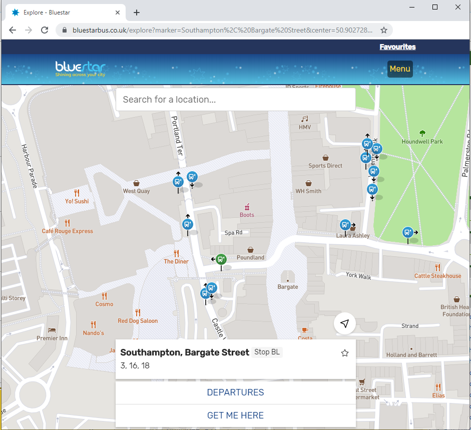
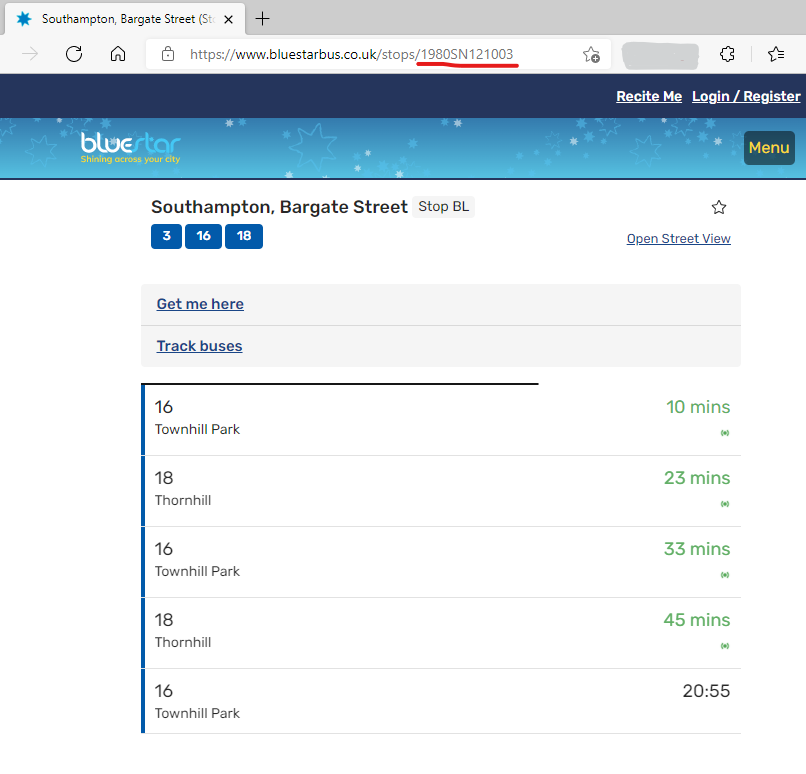
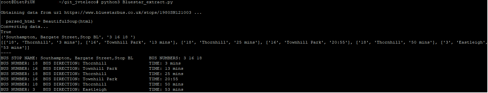

# Bluestar UK buses departure display with a Raspberry Pi.  Optionally, use an OLED display to display and navigate.
https://www.bluestarbus.co.uk

Use the  Bluestar_extract.py  to just display on your console the info.
Use  main_oled_bluestar.py to display on the OLED. You can use the arrows to navigate through the list and the buttons to refresh the data.


The OLED module by default is configured as SPI. It can be changed to I2C by soldering the resistors on the back of the unit.
The OLED library has the I2C definitions, but it has not been tested.

## Hardware
 Raspberry Pi (tested on Raspberry Pi 3 and Zero)
 Optionally: Waveshare 1.3 inch OLED HAT https://www.waveshare.com/wiki/1.3inch_OLED_HAT (Aliexpress or Ebay)


## Software
 - Python3
 - Dietpi OS https://www.dietpi.com  or  Rasperry Pi OS:


### Installing dependencies


#### Dietpi 
login as root:
````
dietpi-config
4-Advanced Options  ->  SPI_State = ON and optionally, also I2C State = ON
reboot

apt install i2c-tools python3-smbus
apt install python3-rpi.gpio
pip3 install beautifulsoup4
pip3 install spidev
pip3 install pillow
sudo apt-get install libopenjp2-7
reboot
````

#### Rasperry Pi OS
NOTE: not tested, some packages may be missing.
````
ip a
sudo raspi-config   (activate I2C and SPI)
sudo apt update
sudo apt upgrade
sudo apt install i2c-tools python3-smbus
sudo apt install python3-rpi.gpio
pip3 install beautifulsoup4
pip3 install spidev
pip3 install pillow
sudo apt-get install libopenjp2-7
sudo reboot
````

### Checks
`ls /sys/class/spi*`
`lsmod | grep spi`

## Download
 Download the code and extract it to your home folder. Rename the folder to your own preference. For example: bluestarbus

## Run
### Obtain the bus stop number
First, you need to go to the Bluestar bus webpage and click on "Plan your journey" (https://www.bluestarbus.co.uk/plan-your-journey)
Now type your bus stop or use "Find your stop on the map". For example, "Southampton, Bargate Street Stop"


On the url, copy and save the bus stop number, e.g.: "1980SN121003"  
(Underlined in red in the following image):



### Modify the code
`cd bluestarbus`

`nano Bluestar_extract.py`   (or use vim or your favorite text editor)

Change the number in the "url_stop_name" variable and if you want, the comment after the hash #:   `url_stop_name = "1980SN121003" #Bargate`

To save the changes, Ctrl+O, press Enter and then Ctrl+X 

For your console:  `python3  Bluestar_extract.py`



For the OLED Display:  `python3  main_oled_bluestar.py`


To stop execution, `Ctrl+C`

### Run code from start up
NOTE 2021: I have not tested this again. It should work (rename the folder name if required).
#### Dietpi
`crontab -e`

`@reboot sleep 30 && cd /home/dietpi/bluestarbus && /usr/bin/python ./main_oled_bluestar.py &`

#### Raspbian
`crontab -e`

`@reboot sleep 30 && cd /home/pi/bluestarbus && /usr/bin/python ./main_oled_bluestar.py &`


# Credits
 jvteleco 2021
